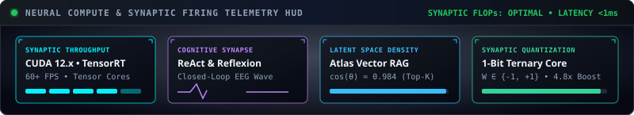
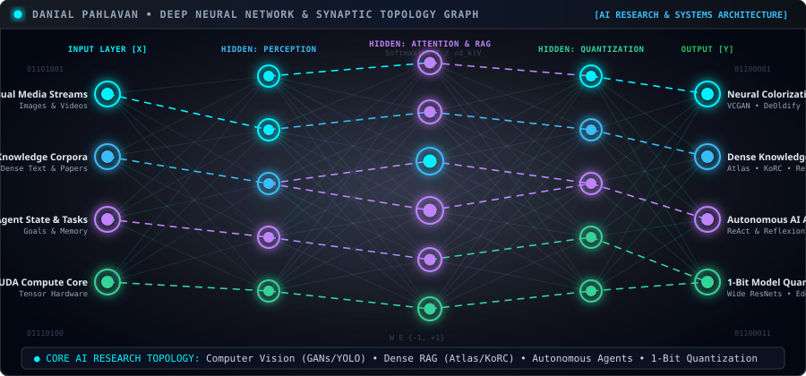
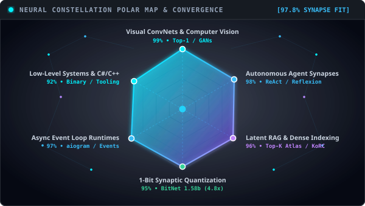

  <!-- Futuristic Cyberpunk Wave Header Banner -->
  

   

  <!-- Dynamic Typing Subtitle -->
  

    

  <!-- Academic, Professional & Social Credentials -->
  

    
    &nbsp;
    
    &nbsp;
    
    &nbsp;
    
    &nbsp;
    
    &nbsp;
    
    &nbsp;
    
  

---

<strong>🧠 Executive Overview & Core AI Research Pillars</strong>

 

  

---

### Technical Proficiencies

  <!-- High-Resolution Graphic SkillIcons Dark Strip -->
  

    
  

  <!-- Geek Cyberpunk Verified Tech Stack Matrix -->
  

---

### Dynamic Activity & Engineering Telemetry

  <!-- Live System Telemetry Status Indicators -->
  

    
    &nbsp;
    
    &nbsp;
    
    &nbsp;
    
    &nbsp;
    
  

   

  <!-- Continuous Contribution & Activity Telemetry (Compact Side-by-Side) -->
  <table border="0" align="center" style="border-collapse: collapse; width: 95%;">
    <tr align="center">
      <td width="50%" align="center" style="padding: 4px; vertical-align: middle;">
        <picture>
          <source media="(prefers-color-scheme: dark)" srcset="https://raw.githubusercontent.com/DanialPahlavan/DanialPahlavan/output/github-contribution-grid-snake-dark.svg">
          <source media="(prefers-color-scheme: light)" srcset="https://raw.githubusercontent.com/DanialPahlavan/DanialPahlavan/output/github-contribution-grid-snake.svg">
          
        </picture>
      </td>
      <td width="50%" align="center" style="padding: 4px; vertical-align: middle;">
        
      </td>
    </tr>
  </table>

   

  <!-- High-Density Telemetry Matrix (Row 1: 2 Cards • Row 2: 3 Cards) -->
  <table border="0" align="center" style="border-collapse: collapse; width: 95%;">
    <tr align="center">
      <td width="50%" align="center" style="padding: 4px;">
        
      </td>
      <td width="50%" align="center" style="padding: 4px;">
        
      </td>
    </tr>
  </table>
  <table border="0" align="center" style="border-collapse: collapse; width: 95%;">
    <tr align="center">
      <td width="33.33%" align="center" style="padding: 4px;">
        
      </td>
      <td width="33.33%" align="center" style="padding: 4px;">
        
      </td>
      <td width="33.33%" align="center" style="padding: 4px;">
        
      </td>
    </tr>
  </table>

 

<strong>🔬 AI Systems Architecture & Research Compute Telemetry</strong>

 

  <!-- Live Compute & Reasoning HUD -->
  
    
  <!-- Neural Architecture Flowchart -->
  
    
  <!-- Radar Chart & Terminal Simulator Side-by-Side -->
  <table border="0" align="center" style="border-collapse: collapse; width: 95%;">
    <tr align="center">
      <td width="50%" align="center" style="padding: 4px; vertical-align: middle;">
        
      </td>
      <td width="50%" align="center" style="padding: 4px; vertical-align: middle;">
        
      </td>
    </tr>
  </table>

 

| Telemetry Dimension | Operational Benchmark & Systems Parameters |
| :--- | :--- |
| **Compute & Acceleration Infrastructure** | Dedicated Linux workstation nodes • CUDA 12.x runtime • PyTorch 2.x • TensorRT / ONNX graph compiler acceleration |
| **Autonomous Agent Orchestration** | Closed-loop `ReAct`, `Reflexion` and Plan-and-Solve reasoning engines • Dynamic tool binding • Multi-agent consensus loops |
| **Computer Vision Pipelines** | High-throughput `YOLO` (v5/v8/v11) inference • `GAN` colorization / restoration (`DeOldify`, `VCGAN`) at 60+ FPS |
| **RAG & Knowledge Retrieval** | Dense semantic indexing • `Atlas` few-shot models • Knowledge-oriented reading comprehension (`KoRC`) |
| **Extreme Neural Quantization** | Low-bit weight representation (`1-bit-per-weight`) • Sub-8-bit matrix arithmetic for low-power edge deployments |
| **Asynchronous Bot & App Frameworks** | Production async Telegram bot architectures (`aiogram`) • High-concurrency event loops • Desktop GUIs (`Tkinter`) |

 

<strong>🚀 Featured Open-Source Engineering Artifacts</strong>

 

  

 

<strong>Open Science & AI Research Sponsorship</strong>

 

If you find my open-source AI implementations, neural models, and development tools valuable, you may support continued independent research through:

### Cryptocurrency 🪙
* **Ethereum (ETH):** `0x526968dF2AB74d7B4132F8D68Cf1BE6D126c6f82`
* **Binance Smart Chain (BNB):** `0x526968dF2AB74d7B4132F8D68Cf1BE6D126c6f82`

### Global & Regional Transfer Channels
* **Ko-fi:** [ko-fi.com/danielpahlavan](https://ko-fi.com/danielpahlavan)
* **WebMoney:** [Donate via WebMoney](https://donate.webmoney.com/w/wDyvsXZ2gZfJT1Tnv39SMt)
* **Regional Support (Iran):** [Reymit](https://reymit.ir/danialpahlavan) • [Coffeete](http://www.coffeete.ir/danialpahlavan)

 

<!-- Matching Cyberpunk Wave Footer Divider -->

  
   
  © 2026 Danial Pahlavan • Deep Learning, Computer Vision, RAG & Autonomous AI Systems

